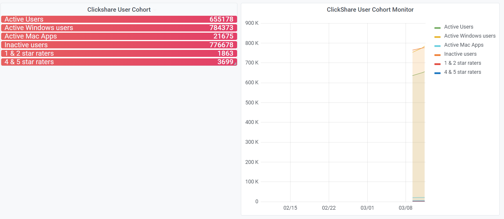

pinreset and its [pin alogirthm](https://www.pinterest.com/pin/149815125082705257/)

## Amplitude Based Recommendation
### amplitude user cohort lists

Here gives a demo for amplitude cohort download and query [JSON-Server for Amplitude User Cohorts](http://dlc2.barco.com:3004/)

## References
* [Netflix Recommendations: Beyond the 5 stars (Part 2)](https://netflixtechblog.com/netflix-recommendations-beyond-the-5-stars-part-2-d9b96aa399f5)
* [Building A Collaborative Filtering Recommender System with TensorFlow](https://towardsdatascience.com/building-a-collaborative-filtering-recommender-system-with-tensorflow-82e63d27b420)
* [推薦系統和TensorRec入門](https://kknews.cc/zh-tw/code/mjzbbgp.html)
* [Boston ML - Architecting Recommender Systems](https://www.slideshare.net/JamesKirk58/boston-ml-architecting-recommender-systems)
* [用Python進行奇異值分解（SVD）實戰指南](https://kknews.cc/news/ymlo5zn.html)
* [FIVE MOST POPULAR SIMILARITY MEASURES IMPLEMENTATION IN PYTHON](https://dataaspirant.com/five-most-popular-similarity-measures-implementation-in-python/)
* [Matrix Factorization- 本文將通過一個詳細的例子分析矩陣分解思想及其在推薦系統上的應用](https://sakura-gh.github.io/ML-notes/ML-notes-html/19_Matrix-Factorization.html)
* [Simple Content-based Recommendation Engine API With Flask [Heroku Deployed]](https://medium.com/@MAbdElRaouf/simple-content-based-recommendation-engine-flask-api-heroku-dd27760dfe8e)
* [Brief on Recommender Systems- Different types of recommendation methods used in industries](https://towardsdatascience.com/brief-on-recommender-systems-b86a1068a4dd)
* [Machine Learning for Recommender systems — Part 1 (algorithms, evaluation and cold start)](https://medium.com/recombee-blog/machine-learning-for-recommender-systems-part-1-algorithms-evaluation-and-cold-start-6f696683d0ed)
* [Machine Learning for Recommender systems — Part 2 (Deep Recommendation, Sequence Prediction, AutoML and Reinforcement Learning in Recommendation)](https://medium.com/recombee-blog/machine-learning-for-recommender-systems-part-2-deep-recommendation-sequence-prediction-automl-f134bc79d66b)
* [Recommendation System in Python: LightFM](https://towardsdatascience.com/recommendation-system-in-python-lightfm-61c85010ce17)
* [HYBRID RECOMMENDER SYSTEM BASED ON PERSONAL BEHAVIOR MINING](https://arxiv.org/ftp/arxiv/papers/1607/1607.02754.pdf)
* [Everything You Should Know about Auto-tagging Customer Feedback](https://monkeylearn.com/blog/auto-tagging-customer-feedback-with-machine-learning/)
* [Compare Google Cloud Natural Language API, IBM Watson Studio, Microsoft Knowledge Exploration Service, and MonkeyLearn](https://www.g2.com/compare/google-cloud-natural-language-api-vs-ibm-watson-studio-vs-microsoft-knowledge-exploration-service-vs-monkeylearn-monkeylearn)
* [Complete Guide: How to use Grafana with a custom Node API](https://dev.to/luckynkosi/complete-guide-how-to-use-grafana-with-a-custom-node-api-2hd5)
* [use Grafana Infinity panel for connecting to REST API endpoints.](https://sriramajeyam.com/grafana-infinity-datasource/)
* [Solving business usecases by recommender system using lightFM](https://towardsdatascience.com/solving-business-usecases-by-recommender-system-using-lightfm-4ba7b3ac8e62)