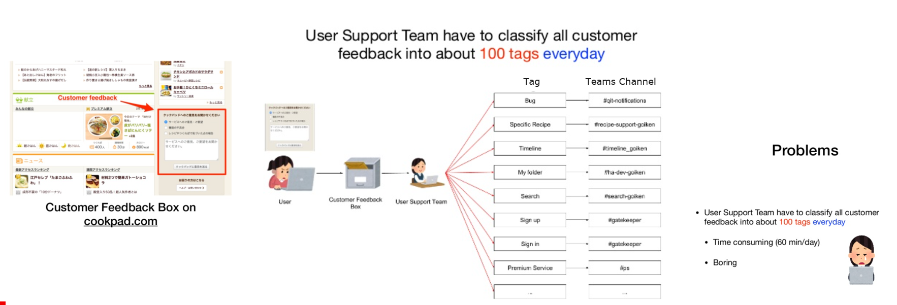
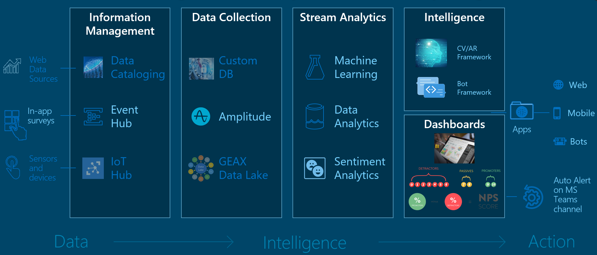
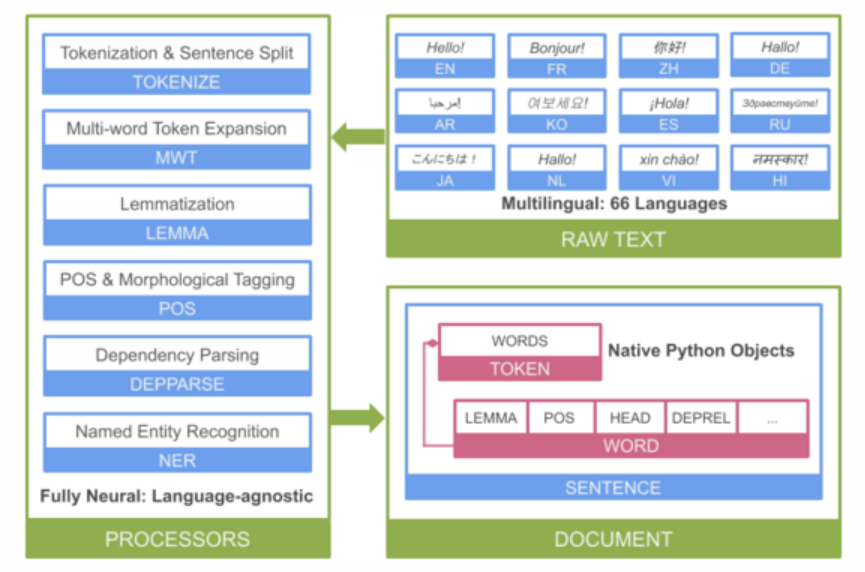

## Project

With the data pipeline below to collect, pre-process, feature-engineer, NLP alogorithm applied to provide useful dashboard for analysis and further actions.

### Steps

---------------------------------
#### Data Collection: 

Data mining or ETL (extract-transform-load) process to collect a corpus of unstructured data.

---------------------------------
#### Data Preprocessing:

* **Tokenization**: Segmentation of running text into words.

* **Lemmatization**: Removal of inflectional endings to return the base form.
    
* **Parts-of-speech tagging**: Identification of words as nouns, verbs, adjectives etc.

* **Lanaguage detection**: Identification of the lanauges from single or several sentensces even a short one.

---------------------------------
#### Feature Engineering (NLP visualization):

* Word Embeddings: Transforming text into a meaningful vector or array of numbers.

* N-grams: An unigram is a set of individual words within a document; bi-gram is a set of 2 adjacent words within a document.

* TF-IDF values: Term-Frequency-Inverse-Document-Frequency is a numerical statistic representing how important a word is to a document within a collection of documents.

---------------------------------
#### Application of NLP Algorithms:

* Latent Dirichlet Allocation: **Topic modeling** algorithm for detecting abstract themes from a collection of documents.

* Support Vector Machine: Classification algorithm for detection of underlying **consumer sentiment**.

* Long Short-Term Memory Network: Type of recurrent neural networks for machine translation used in Google Translate.

## Scope

* Topic Modeling:
    How to automatically categorize customer complaints or intent classification?

* Sentiment analysis
    - How to detect sentiment from customer feedback, a complaint or a positive feedback?
    - How to detect urgency?

## Implementation: WinkNLP

### Customize tagging keyword

* [What is wink-eng-lite-model?](https://github.com/winkjs/wink-eng-lite-model)
* [Custom Entities](https://winkjs.org/wink-nlp/custom-entities.html)
* [How to do sentiment analysis?](https://winkjs.org/wink-nlp/how-to-sentiment-analysis-javascript.html)

## Implementation: spaCy

### Customize tagging keyword

A high level view of generic model and the refine model in the whole process.

The detailed NLP refinement model is as below to improve the models of NER Tagging in spaCy model on user feedback.

Another better idea is **Active learning** as below

and the whole data pipeline diagram for user feedback tagging is as below

[](http://www.plantuml.com/plantuml/uml/ZPHTJ_is5CRl_IcE-h-hbBwqW50r0Hsm2GbGD-2gwyLfV9fQE7PcEspLkky-noLAdEMYDv3aFB_Zn-UbTzQXSMKkcVqKga23EGZboEmm9VY70Mmn_SoCBXM_rr8RE92K-gyge0qdS_ge3QgCsB-CCIUS97XzNi7hu--m4WL9eGXsNlLXoS0lHBpA2U-OPK9bZ3Nd3VRE5OlncCjqDjgYIVKerVdYOZQPZYqf9tB_Pm1eWHGlj0Ud_VH5YxwUN4yYPjRFnCXLXCpxaNcBcKycquYvw6TY97Ps2JyoGwIwfFMe8ypjA1UfqLRlN9LWBCVf7fKY6MMvWX-6k6-5fCn_0qaxnux3OTKFvujE1bReeU7m2ESK_5Z1pxWbcLZ7XOwvRgc3-adjPFdtmyznowDZ-wiUwDNZwWr-AyaSOgA_w07vrU0E5SANi5ZA2EklUw3Ugvh2VQXXa9zLx2CZnK-rPIoLkkH-KTRBl932bPmsOGquEjoYzGrCqLfKtE0Wx5CZ_4CzvOKsZan0KktV52a7Wwe0bNhz-5Mz_rcLOWD9QxJEoM8Bl3-4DBxpOTsy9acQrLdNJIrzLrkH6Lk_Q4uIFWgETUBcGdLpMmwb3iaPMp-WtMyr6kxzDeRd7MlVxV8PFB8oEYUtfz8ckGsLt_oK9Ekb9EDUK5M95_2gdTY959tGYaMnIjkaw4hR8U_ePlrzz8RLJ-4pDCQdFjIyHDUux5pZfHuG29CK2XAU8khAK-tvy2RwkhS04HxxUnjCHlEmEFtl3Cbev6LnznRVk_HkK2YXCdWZPpkOfw9fE0iAbbgpLJD1PBj35EJTGvQbqsFmdInHmb8fxRosJX2B8UcvsSaVXC__Et3KjNUArEec578teno9QrEyTXNh_AMQQV7KWx25n4D7DRg9vl3qAn-EQAvxUzk5cc7jI7jtnXi9izVTW3jIlCpbVm00)

## References
* [MonkeyLearn: How to Do Customer Complaint Classification with AI](https://monkeylearn.com/blog/customer-complaint-classification/)
* [Humanizing Customer Complaints using NLP Algorithms](https://towardsdatascience.com/https-medium-com-vishalmorde-humanizing-customer-complaints-using-nlp-algorithms-64a820cef373)
* [Twitter Sentiment Analysis: A tale of Stream Processing](https://towardsdatascience.com/twitter-sentiment-analysis-a-tale-of-stream-processing-8fd92e19a6e6)
* [9 Practical Tips for an Effective NPS Data Analysis and Reporting](https://www.retently.com/blog/nps-data-analysis-reporting/)
* [The right survey to measure each touchpoint of the customer journey](https://www.getfeedback.com/resources/customer-journey-mapping/the-right-survey-to-measure-each-touchpoint-of-the-customer-journey/)
* [Measuring Customer Experience Beyond NPS](https://www.pointillist.com/blog/how-to-measure-customer-experience-beyond-nps/)
* [NLP visualizations for clear, immediate insights into text data and outputs](https://medium.com/plotly/nlp-visualisations-for-clear-immediate-insights-into-text-data-and-outputs-9ebfab168d5b)
* [Predicting happiness: user interactions and sentiment analysis in an online travel forum](https://link.springer.com/article/10.1007/s40558-017-0079-2)
* [Analyzing Customer reviews using text mining to predict their behaviour](https://medium.com/analytics-vidhya/customer-review-analytics-using-text-mining-cd1e17d6ee4e)
* [Awesome Sentiment Analysis](https://github.com/laugustyniak/awesome-sentiment-analysis)
* [10 Popular Datasets For Sentiment Analysis](https://analyticsindiamag.com/10-popular-datasets-for-sentiment-analysis/)
* [中文情感分析 (Sentiment Analysis) 的难点在哪？现在做得比较好的有哪几家？](https://www.zhihu.com/question/20700012)
* [Social Media Data for Sentiment Analysis](http://cucis.ece.northwestern.edu/projects/Social/sentiment_data.html)
* [Complete Guide: How to use Grafana with a custom Node API](https://dev.to/luckynkosi/complete-guide-how-to-use-grafana-with-a-custom-node-api-2hd5)
* [NATURAL LANGUAGE PROCESSINGNew AI Detects Sarcasm in Social Media](https://www.unite.ai/new-ai-detects-sarcasm-in-social-media/)
* [Hubspot vs. Marketo: A Side-by-Side Comparison](https://technologyadvice.com/blog/marketing/hubspot-vs-marketo-comparison/)
* [What Is Marketo? A Marketer's Guide](https://www.cmswire.com/digital-marketing/what-is-marketo-a-marketers-guide/)
* [Amplitude Recommend- Marketo / Amplitude Integration](https://help.amplitude.com/hc/en-us/articles/360034362071-Marketo-Amplitude-Integration)
* [何謂精準行銷 Precision Marketing？精準行銷思維進化史！](https://medium.com/marketingdatascience/%E4%BD%95%E8%AC%82%E7%B2%BE%E6%BA%96%E8%A1%8C%E9%8A%B7-precision-marketing-%E7%B2%BE%E6%BA%96%E8%A1%8C%E9%8A%B7%E6%80%9D%E7%B6%AD%E9%80%B2%E5%8C%96%E5%8F%B2-fae501626904)
* [NLP for Beginners: Cleaning & Preprocessing Text Data](https://towardsdatascience.com/nlp-for-beginners-cleaning-preprocessing-text-data-ae8e306bef0f)
* [Tutorial: Cleaning CSV Data Using the Command Line and csvkit](https://www.dataquest.io/blog/data-cleaning-command-line/)
* [csvkit: a Swiss Army Knife for CSV Data ?](https://towardsdatascience.com/csvkit-a-swiss-army-knife-for-csv-data-286db551547b)
* [csvtk - A cross-platform, efficient and practical CSV/TSV toolkit](https://bioinf.shenwei.me/csvtk/)
* [Build better products and make better decisions with Iterate.](https://medium.com/@siftery/build-better-products-and-make-better-decisions-with-iterate-5e8f3c0c3986)
* [How to Motivate Beta Testers to Give You Regular Product Feedback](https://community.uservoice.com/blog/how-to-motivate-beta-testers/)
* [Chapter-2 AI Based Next best offer (Behaviour Driven Marketing and CDP)](https://www.linkedin.com/pulse/chapter-2-ai-based-next-best-offer-behaviour-driven-marketing-peshin/)
* [Benchmarking Language Detection for NLP](https://archive.ph/HBQjF)
* [A Complete Guide to Natural Language Processing (NLP)](https://litslink.com/blog/a-complete-guide-to-natural-language-processing-nlp)
* [spaCy- Language Processing Pipelines](https://spacy.io/usage/processing-pipelines)
* [How to Use AI in Excel for Automated Text Analysis](https://monkeylearn.com/blog/how-to-use-ai-in-excel-for-automated-text-analysis/)
* [The Complete Guide to Building a Chatbot with Deep Learning From Scratch](https://towardsdatascience.com/complete-guide-to-building-a-chatbot-with-spacy-and-deep-learning-d18811465876)
* [進入 NLP 世界的最佳橋樑：寫給所有人的自然語言處理與深度學習入門指南](https://leemeng.tw/shortest-path-to-the-nlp-world-a-gentle-guide-of-natural-language-processing-and-deep-learning-for-everyone.html)
* [What are the Limitations of Automatic Image Annotation vs Manual?](https://medium.com/anolytics/what-are-the-limitations-of-automatic-image-annotation-vs-manual-a8ff7edb3152)
* [Cohort Analysis: An Insider Look at Your Customer's Behavior](https://www.g2.com/articles/cohort-analysis)
* [Amplitude Recommend- Analyze your predictive cohort](https://help.amplitude.com/hc/en-us/articles/360049164712-Build-a-prediction)
* [Customer cohort analysis: Using event data to understand customer behavior](https://faraday.ai/blog/customer-cohort-analysis-predict-behavior/)
* [Customer Cohort Analysis vs User Cohort Analysis: What’s The Difference?](https://amplitude.com/blog/customer-cohort-analysis-vs-user-cohort-analysis)

### spaCy NER
* [How to create training data for spaCy NER models using ipywidgets](https://enrico-alemani.medium.com/how-to-create-training-data-for-spacy-ner-models-using-ipywidgets-c4aa71bf61a2)
* [Training Spacy NER models with doccano](https://medium.com/@justindavies/training-spacy-ner-models-with-doccano-8d8203e29bfa)
* [NLP: Named Entity Recognition (NER) with Spacy and Python](https://archive.ph/ctAhy)
* [Prepare training data and train custom NER using Spacy Python](https://thinkinfi.com/prepare-training-data-and-train-custom-ner-using-spacy-python/)
* [Using spaCy 3.0 to build a custom NER model](https://archive.ph/lhxV5)
* [Extend Named Entity Recogniser (NER) to label new entities with spaCy](https://archive.ph/UBNB5)
* [How to Train NER with Custom training data using spaCy](https://manivannan-ai.medium.com/how-to-train-ner-with-custom-training-data-using-spacy-188e0e508c6)
* [Building a custom Named Entity Recognition model using SpaCy](https://archive.ph/Y4hzq#selection-461.0-461.60)
* [tecoholic/ner-annotator Github](https://github.com/tecoholic/ner-annotator)

## NLP Kits
* [wink-js- GitHub](https://github.com/winkjs/wink-nlp)
* [nltk/nltk: NLTK Source - GitHub](https://github.com/nltk/nltk)
* [flairNLP/flair: A very simple framework for state-of-the-art Natural Language Processing (NLP)- GitHub](https://github.com/flairNLP/flair)
* [Industrial Strength NLP- GitHub](https://github.com/EthicalML/awesome-production-machine-learning#industrial-strength-nlp)
* [Tools for named entity recognition](https://www.clarin.eu/resource-families/tools-named-entity-recognition)
* [Introducing spaCy v3.0](https://explosion.ai/blog/spacy-v3)
* [spaCy 3.0 demo](https://explosion.ai/software)

## Label Annotation
* [The 5 Best Data Annotation Platforms & Tools for Machine Learning (2021)](https://anthony-sarkis.medium.com/the-5-best-ai-data-annotation-platforms-for-machine-learning-2021-ec17c15142f3)
* [heartexlabs/awesome-data-labeling- Github](https://github.com/heartexlabs/awesome-data-labeling)
* [doccano/awesome-annotation-tools- Github](https://github.com/doccano/awesome-annotation-tools)

## ML Backend
* [Predictive Maintenance with Deep Learning and Apache Flink](https://www.slideshare.net/ssuser6bb12d/predictive-maintenance-with-deep-learning-and-apache-flink)
* [Applying Machine Learning Models to InfluxDB with Loud ML & Docker for Time Series Predictions](https://dganais.medium.com/applying-machine-learning-models-to-influxdb-with-loud-ml-docker-for-time-series-predictions-c4ffa4fc5174)