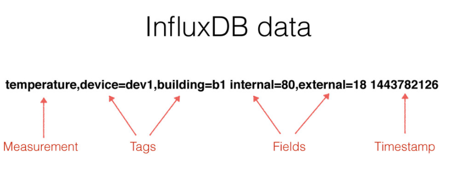

## AIOT data collection

AIOT is the combination of AI and IOT. Three major steps for AIOT: **data**, **intelligence**, **actions** mean **data collection**, **smart data intelligence**, then **actions** accordingly. For **data collection**, **IOT devices events** and **user behaviorial events** might be collected via several approaches. Here we focus on the approaches of data collections and aggreagration. 

### via InfluxDB

**Data collection**, or IOT devices and user behaviorial events collection, can be formulated as **time series** or **events** and and stored in **times series database** ([TSDB](https://www.influxdata.com/time-series-database/))

a time series or event can be in the form of

```
measurement tag fields timestamp
```
andd an example as
```
temperature,device=device1,buidling=b1 internal=80,external=18 1443782126
```

[]()


[influxDB](https://www.influxdata.com/) is the top solution for ([TSDB](https://www.influxdata.com/time-series-database/)) as collectors, aggregators and visualizer and its block digram as below.

[](https://www.influxdata.com/time-series-platform/telegraf/)

A showcase of IOT data collection architecture via influxDB.

[](https://davidgs.com/posts/category/iot/iot-hardware/building-an-influxdb-iot-edge-data-collection-device/)

[](https://www.influxdata.com/blog/tldr-influxdb-tech-tips-time-series-forecasting-with-telegraf/)

A detailed pipeline for telegraf plugins: Inputs, outputs, processors plugins to process the data.

[](https://sysadmin.info.pl/en/how-to-setup-and-secure-telegraf-influxdb-and-grafana-on-linux/)

An example show how [FLUX](https://docs.influxdata.com/influxdb/v2.0/query-data/) to handle the data source [buckets](https://docs.influxdata.com/flux/v0.7/introduction/getting-started#buckets), [pipe](https://docs.influxdata.com/flux/v0.7/introduction/getting-started#pipe-forward-operator), and  [forward operator](https://docs.influxdata.com/flux/v0.7/introduction/getting-started#pipe-forward-operator), and [tables](https://docs.influxdata.com/flux/v0.7/introduction/getting-started#tables).

```sql 
from(bucket:"mongo")
  |> range(start:-1h)
  |> filter(fn:(r) =>
    r._measurement == "cpu" and
    r.cpu == "cpu-total"
  )
  |> aggregateWindow(every: 1m, fn: mean)
```


## References
* [How To Install InfluxDB Telegraf and Grafana on Docker](https://devconhttps://sysadmin.info.pl/wp-content/webp-express/webp-images/doc-root/wp-content/uploads/2020/09/diagram-2.png.webpnected.com/how-to-install-influxdb-telegraf-and-grafana-on-docker/)
* [Nextcloud to influxDB (Grafana for display) with telegraf](https://blog.lbdg.me/nextcloud-influxdb-telegraf-grafana/)
* [Cassandra vs. InfluxDB vs. MongoDB](https://db-engines.com/en/system/Cassandra%3BInfluxDB%3BMongoDB)
* [Flux Windowing and Aggregation](https://dzone.com/articles/flux-windowing-and-aggregation)
* [GJSON PLAYGROUND](https://gjson.dev/)
* [influxdata/telegraf- HTTP Input Plugin](https://github.com/influxdata/telegraf/tree/master/plugins/inputs/http)
* [IoT - Home sensor data monitoring with MQTT, InfluxDB and Grafana](http://nilhcem.com/iot/home-monitoring-with-mqtt-influxdb-grafana)